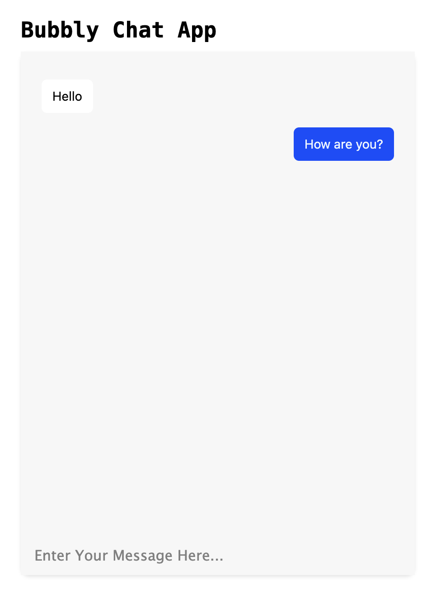

# Bubbly - A Real-Time Messaging App 🗨️

Bubbly is a basic real-time messaging app, facilitating instant communication between users. Utilising the power of Socket.io along with Vanilla JavaScript, HTML, and CSS, Bubbly ensures that conversations flow in real time.




## Table of Contents

- [Bubbly - A Real-Time Messaging App 🗨️](#bubbly---a-real-time-messaging-app-️)
  - [Table of Contents](#table-of-contents)
  - [Features](#features)
  - [Installation](#installation)
  - [Usage](#usage)
  - [Future Plans](#future-plans)
  - [License](#license)

## Features

- **Real-Time Messaging**: Engage in conversations with real-time message updates.
  
## Installation

1. Clone the repository:
    ```bash
    git clone https://github.com/RGBlife/bubbly.git
    ```

2. Navigate to the project directory:
    ```bash
    cd bubbly
    ```

3. Install dependencies:
    ```bash
    npm install
    ```

## Usage

1. Start the server:
    ```bash
    npm run start
    ```

2. Open your browser and visit:
    ```
    http://localhost:3000
    ```

3. Begin engaging in real-time conversations!

## Future Plans
- **Hosting**: Plans to host the application online for broader access and usability - DONE
- **User Login System**: An authentication system to manage user sessions

## License

MIT License. See [LICENSE](LICENSE) for more information.
